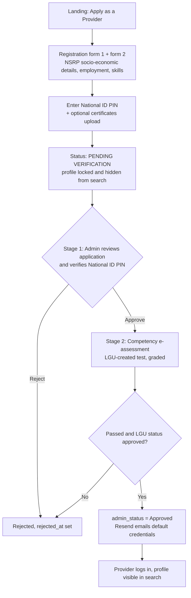
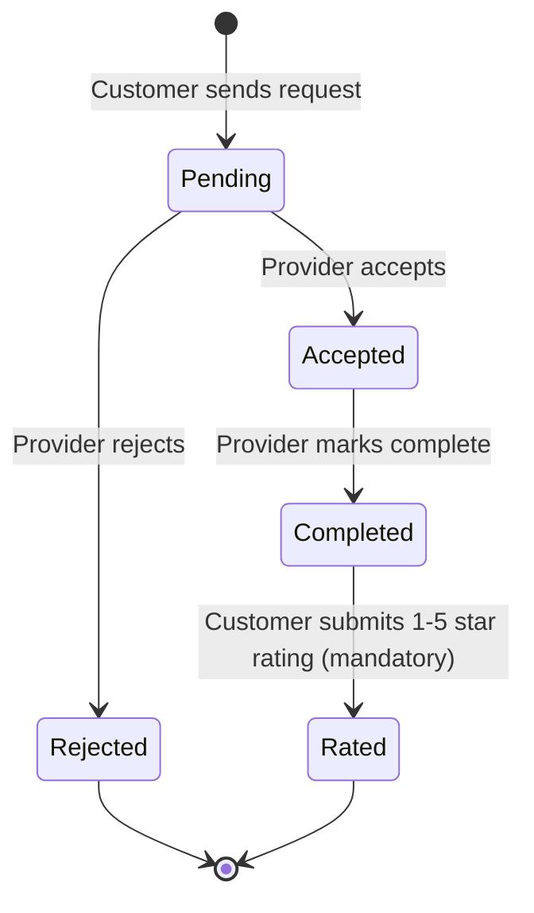

# CAPSTONE_DOCS.md

> **CommuniServe: LGU Workforce System for Service Provider**
> Municipality of Anini-y, Antique (23 barangays)
> Build-reference distilled from the capstone paper (Chapters I–III). Written to be read by **Claude Code** and by the developer while building.
> ISO/IEC 25010 / McCall evaluation content is intentionally **excluded**; this file covers only what is needed to build the web app.

---

## 0. How to use this file

**Legend**

| Tag | Meaning |
|---|---|
| `[DOC]` | Stated directly in the capstone paper. Treat as a requirement. |
| `[INFERRED]` | Not stated outright, but strongly implied by the paper/ERD/screenshots. Reasonable default; confirm. |
| `[DECIDE]` | Paper is silent, ambiguous, or contradicts itself. A decision is needed (see §18). |

**Stable reference IDs** (use these in prompts, commits, and PR descriptions):

| Prefix | Meaning | Section |
|---|---|---|
| `O1–O6` | Specific objectives | §7 |
| `M0–M9` | Modules | §7 |
| `BR-xx` | Business rules | §8 |
| `T-<table>` | Database tables | §9 |
| `TC-01…TC-11` | Test cases (acceptance criteria) | §15 |
| `Q-xx` | Open questions | §18 |

**Rules for Claude Code when working from this file**

1. Before building a module, read its entry in §7, the business rules it cites in §8, and its tables in §9.
2. Do **not** add features outside scope (§2). If something seems missing, check §18 first.
3. If a `[DECIDE]` item blocks the work, **ask the developer**; don't silently pick.
4. Never expose the Supabase **service role key** to the browser. Privileged writes go through Next.js Route Handlers only (§5, §11).
5. When finishing a module, tick its box in §19 and confirm its `TC-xx` in §15 passes.
6. The **Supabase migrations are the source of truth** for schema once created. §9 is the paper's design (ERD, Fig. 9) and may drift.

**Example prompts**

```
Implement M4 (Hiring) per CAPSTONE_DOCS.md §7. Respect BR-06, BR-08, BR-11.
Use tables T-job_requests, T-providers, T-customers. Verify against TC-05.
```
```
Read §9 and §10, then write the Supabase migration for M1 including RLS per §11.
```
```
Audit the current repo against §8 (business rules). List any rule that is not enforced.
```

### 0.1 Deviations from the paper (developer decisions; these override the paper)

| # | Paper says | This project does | Affects |
|---|---|---|---|
| **D-1** | Providers **upload a National ID photo**; admin views it through a signed URL (Fig. 11 "ID Attached" column, p.54-56, TC-07, Training Track B) | Providers enter **only their National ID PIN number**. **No ID photo upload.** Admin verifies the PIN manually. | §3, §5, §6.1, M1, M7, BR-02, BR-10, **BR-17**, §9 (`provider_identity`), §10, §11, §16, Q-01, Q-18 |

> Certificates (portfolio, TC-11) and avatars are still uploaded files. Only the National ID image is removed.

---

## 1. Project snapshot

| Item | Detail |
|---|---|
| **System name** | CommuniServe: LGU Workforce System for Service Provider `[DOC p.1]` |
| **Type** | Web-based platform (responsive, mobile-first). No offline mode. `[DOC p.9]` |
| **Problem** | No centralized/verified way to find local workers; residents rely on unreliable word-of-mouth and social media posts; unknown-but-skilled workers can't gain clients. `[DOC p.1]` |
| **Solution** | LGU-led verified registry of service providers with National ID verification, LGU e-assessment, a structured hiring flow, and mandatory 1–5★ ratings. `[DOC p.1–2]` |
| **Geography** | Anini-y, Antique only. `[DOC p.8]` |
| **Service categories (only these 3)** | Electrician, Carpenter, Nanny/Housemaid (UI screenshot uses **"Kasambahay"**). `[DOC p.8, Fig. 11]` |
| **Users** | Customers (residents), Service Providers, LGU/PESO Administrators. `[DOC p.6–7]` |
| **Methodology** | Agile, sprint-based. `[DOC p.23–24]` |
| **Deliverables** | Working system, user documentation, final project report. `[DOC p.3]` |

**General objective:** Design and develop CommuniServe, a web platform for Anini-y that centralizes and professionalizes the local service market through mandatory LGU verification and a structured hiring system. `[DOC p.3]`

---

## 2. Scope & delimitations `[DOC p.8–9]`

**In scope**
- Registration for customers and providers
- National ID–based identity verification for providers via **PIN number** (anti-fraud; no ID photo upload, see §0.1 D-1)
- LGU-mediated two-stage verification (application + e-assessment)
- Verified provider registry + portfolio pages
- Search/filter by category, barangay, rating
- Hiring workflow: request → accept/reject → complete
- Mandatory 1–5★ rating after completion
- Real-time job status
- Admin (LGU/PESO) dashboard
- SMS notification to providers (Semaphore.co); email OTP/credentials (Resend)

**Out of scope**
- Any service category other than electrician / carpenter / nanny-housemaid
- Any municipality other than Anini-y
- Offline functionality
- Integration with external provincial/agricultural information systems
- Native mobile app (web only, even though the test plan loosely says "mobile application", see Q-09)
- Online payments (not in objectives; earlier reviewed systems had them, CommuniServe does not) `[INFERRED]`

---

## 3. Roles & permissions

| Capability | Customer | Provider | Admin (LGU/PESO) | Anonymous |
|---|:-:|:-:|:-:|:-:|
| View landing page | ✔ | ✔ | ✔ | ✔ |
| Sign up as customer (email OTP) | – | – | – | ✔ |
| Apply as provider (application form) | – | – | – | ✔ |
| Log in (universal login, role-based redirect) | ✔ | ✔ | ✔ | – |
| Search/browse **approved** providers | ✔ | – `[DECIDE]` | ✔ | – `[DECIDE]` |
| View provider profile | ✔ | own | all | – `[DECIDE]` |
| Send job request | ✔ | – | – | – |
| Accept / reject job request | – | ✔ (own) | – | – |
| Mark job completed | – | ✔ (own) | – | – |
| Rate provider (after completion) | ✔ (own jobs) | – | – | – |
| Edit own profile | ✔ | ✔ (portfolio) | ✔ | – |
| View provider's National ID PIN (unmasked) | – | own | ✔ | – |
| View provider certificates/documents | – | own | ✔ (signed URL) | – |
| Approve / reject provider applications | – | – | ✔ | – |
| Create / manage assessments, grade tests | – | – | ✔ | – |
| View labor statistics / manage users | – | – | ✔ | – |

Roles are stored in `T-users.role`. Three values: `customer`, `provider`, `admin`. `[INFERRED from TC-03]`

---

## 4. Tech stack `[DOC p.2, 29–31, 39–40]`

| Layer | Technology | Notes |
|---|---|---|
| Front-end | HTML, CSS, JavaScript, **JSX** | Paper says JavaScript/JSX (not TypeScript), see Q-10 |
| Framework | **Next.js** (React) | SSR, routing, Route Handlers as REST API |
| Styling | **Vanilla CSS** | Explicit choice: lightweight, mobile-friendly. **No Tailwind/UI kits.** |
| Backend/DB/Auth | **Supabase** (PostgreSQL, GoTrue Auth, Storage, RLS) | Use `@supabase/supabase-js` |
| SMS | **Semaphore.co** (PH SMS gateway) | Notify providers of new job requests |
| Email | **Resend** | 6-digit customer OTP + default credentials for approved providers |
| IDE | Visual Studio Code | |
| Repo / CI-CD | **GitHub** → **Vercel** auto-deploy | |
| Hosting | **Vercel** | Edge deployment for low-bandwidth rural users |

**Environment variables** `[INFERRED]`

```bash
NEXT_PUBLIC_SUPABASE_URL=
NEXT_PUBLIC_SUPABASE_ANON_KEY=
SUPABASE_SERVICE_ROLE_KEY=        # SERVER ONLY. Never NEXT_PUBLIC_
SEMAPHORE_API_KEY=                # SERVER ONLY
FORCE_REAL_SMS=                   # dev only: true sends live SMS instead of logging
RESEND_API_KEY=                   # SERVER ONLY
RESEND_FROM_EMAIL=
NEXT_PUBLIC_APP_URL=
```

---

## 5. Architecture `[DOC p.27–28, Fig. 7 & Fig. 13]`

```
Browser (Admin / Customer / Provider)
   │ HTTPS
   ▼
Next.js on Vercel ── App Router → Server Components → Route Handlers (REST)
   │                                   │            │
   │ (Supabase client SDK,             │            ├──► Semaphore SMS Gateway
   │  session token + RLS reads)       │            └──► Resend Email API
   ▼                                   ▼
Supabase Cloud:  GoTrue Auth  ·  Kong API Gateway  ·  PostgreSQL (RLS)  ·  Object Storage (private buckets)
```

Key architectural facts:

- **Two data paths** from the client:
  1. **Direct, RLS-protected reads** via the Supabase client SDK using the user's session (JWT). `[DOC Fig. 13: "Direct RLS Data Read"]`
  2. **Privileged writes/overrides** through Next.js Route Handlers using the **service role** (`"Service Role Secure Write"`, `"Admin Overrides & Webhooks"`). `[DOC Fig. 13]`
- **Files** (certificates, avatars) go by **direct binary upload to Supabase Storage**, bypassing transactional tables. The DB stores only **file path references** (`T-provider_files.file_path`). `[DOC p.27–28]` National ID photos are **not** uploaded (see §0.1 D-1).
- **Certificates/documents live in private buckets**; admin views them through **server-signed URLs that expire in a few minutes**. `[DOC p.55]` The **National ID PIN** is a text value in its own table (`T-provider_identity`) protected by RLS, see BR-17.
- **Route Handlers** trigger Semaphore SMS and Resend email. `[DOC Fig. 13]`
- Session/identity: GoTrue (Supabase Auth) issues JWTs; role-based redirect after login.

---

## 6. Core workflows

### 6.1 Provider onboarding & two-stage LGU verification `[DOC p.7, 26, 31–32, 36–37, 55–56]`



> The **exact order** of "approve application" vs. "take e-assessment" vs. "receive credentials" is not fully specified. The diagram above is the most consistent reading. **See Q-01 and Q-02.**

### 6.2 Customer onboarding `[DOC p.31, TC-02]`

1. Customer signs up (email, password, name, contact number, barangay).
2. System emails a **6-digit OTP** via Resend (stored in `T-customer_otps` with `expires_at`).
3. Customer enters OTP → account verified → `T-users` + `T-customers` rows → `onboarding_complete = true`.
4. Customer lands on dashboard (search, requests, profile).

### 6.3 Hiring lifecycle `[DOC p.3–4, 7, 32, 37]`



- SMS goes to the provider the moment a request is created (`BR-08`).
- Provider still needs internet briefly to open the app and accept. `[DOC p.55]`
- ERD has `requested_at`, `accepted_at`, `started_at`, `completed_at` timestamps → see Q-04 about a possible "In Progress" state.

### 6.4 "How the project will work" (4-step summary) `[DOC p.31–32]`

1. **Secure Entry**: sign up as Client or Provider; providers do National ID verification.
2. **Smart Search**: search by trade (e.g., "Electrician"), filter by barangay, see ratings.
3. **The Handshake**: client sends digital request → provider gets phone notification → accepts per schedule.
4. **Feedback & Growth**: provider marks complete → client gives **mandatory** 1–5★ rating → builds reputation; LGU sees who excels.

---

## 7. Modules

Objective ↔ Module ↔ FDD sub-functions ↔ Tests. (FDD = Functional Decomposition Diagram, `[DOC p.33–34]`.)

### M0. Authentication & Roles (Universal Login) — *supports all objectives*
- **Test:** `TC-03`
- **Scope:** one login screen for all roles; redirect Customer / Provider / Admin to their dashboards.
- **Tables:** `T-users`, `auth.users` (`T-auth_users`), `T-admins`
- **Rules:** BR-03, BR-11, BR-15
- **Notes:** Supabase Auth email+password; JWT session in cookies. Customer sign-in card has a "Sign Up as Customer" CTA (Fig. 12). `[DOC]`

### M1. Service Registry Module — **O1** *(Provider Registration + Verification)*
- **Objective text:** "Mandate a two-stage LGU verification process, including digital application filing and assessment for local providers." `[DOC p.3]`
- **FDD (Registry & Onboarding):** Registration form 1 · Registration form 2 · **National ID verification** · Competency test · Socio-econ capture · Address sync
- **Tests:** `TC-01` (registration → "Pending Verification"), `TC-07` (admin approval), `TC-06` (assessment)
- **Tables:** `T-users`, `T-providers`, `T-provider_identity`, `T-nsrp_details`, `T-employment_details`, `T-skills`, `T-provider_files`, `T-assessments`, `T-assessment_attempts`
- **Rules:** BR-01, BR-02, BR-03, BR-05, BR-10, BR-14, BR-16, BR-17
- **Notes:**
  - Form captures the **DOLE NSRP** registration data (name, DOB, sex, civil status, present/permanent address, parents, 4Ps / indigent / PWD / senior / solo-parent flags) plus employment details. `[DOC p.34, 37]`
  - National ID is verified through the **PIN number only** (no photo, see §0.1 D-1): (1) the provider enters the PIN in the application form (stored in `T-provider_identity`, BR-17); (2) PESO admin manually cross-checks it (with name/birthdate) against official records and marks it verified. The IPO figure mentions a National ID API, but no API is assumed, see Q-01.

### M2. Customer Account Management Module — **O2** *(includes Customer Registration)*
- **Objective text:** "Allow residents to manage their personal profiles and track the status of their service requests." `[DOC p.3]`
- **Tests:** `TC-02` (registration + OTP), `TC-10` (profile update + track requests)
- **Tables:** `T-users`, `T-customers`, `T-customer_otps`, `T-job_requests`
- **Rules:** BR-04, BR-11
- **Features:** edit profile (name, contact number, barangay, preferred barangay), view own requests with live status.

### M3. Service Provider Portfolio Module — **O3**
- **Objective text:** "Allow verified workers to showcase their specific skills, credentials, and availability to the community." `[DOC p.3]`
- **FDD (Search & Discovery → Provider profile view)** + provider-side editing
- **Test:** `TC-11` (edit profile, modify trade credentials, upload/manage certificates)
- **Tables:** `T-providers` (bio, trade_category, average_rating), `T-skills`, `T-provider_files`
- **Rules:** BR-01, BR-10
- **Displays:** skills, credentials/certificates, barangay location, **availability**, ratings. `[DOC p.7]`
- **Gap:** ERD has **no availability field** → Q-05 / §10.
- Training track B mentions providers will "toggle their availability calendars". `[DOC p.56]`

### M4. Hiring Management Module — **O4**
- **Objective text:** "Automate the job request flow, allowing customers to send requests and providers to manage statuses from Pending to Completed and Accepted or Rejected." `[DOC p.4]`
- **FDD (Hiring & Job Management):** Job request send · Accept/decline · Ongoing tracking · Job completion mark · Status lifecycle log
- **Test:** `TC-05` (customer submits request → appears as "Pending" on provider account)
- **Tables:** `T-job_requests`, `T-customers`, `T-providers`
- **Rules:** BR-06, BR-08, BR-11
- **Request fields (from ERD):** `service_description`, `service_street`, `service_barangay`.

### M5. Search & Filtering Module — **O5**
- **Objective text:** "Browse the service registry based on service categories, barangay location, and provider ratings." `[DOC p.4]`
- **FDD (Search & Discovery):** Category filter · Barangay filter · **Approved-only view** · Rating display · Provider profile view
- **Test:** `TC-09`
- **Tables:** `T-providers`, `T-users` (barangay), `T-skills`, `T-ratings`
- **Rules:** BR-01, BR-09, BR-12
- **Notes:** default filter to the customer's `preferred_barangay` `[INFERRED]`; results sortable by rating; results must be **approved-only**.

### M6. Rating Module — **O6**
- **Objective text:** "Requires customers to submit a 1 to 5 star evaluation upon job completion to maintain service quality and provider accountability." `[DOC p.4]`
- **FDD (Rating & Feedback):** Completed job-lock · 1–5 star submission · Avg. score compute · Review text capture · Reputation feedback
- **Test:** `TC-04` (customer submits rating; provider's new average is correct)
- **Tables:** `T-ratings`, `T-job_requests`, `T-providers.average_rating`
- **Rules:** BR-07, BR-11

### M7. Admin Dashboard Module (LGU/PESO) — *supports O1*
- **FDD (Admin & LGU Dashboard):** Provider approval · Test grading · Registry management · Labor statistics · User account control
- **Test:** `TC-07`
- **Tables:** `T-admins`, `T-providers`, `T-provider_identity`, `T-provider_files`, `T-assessments`, `T-users`
- **UI (Fig. 11):**
  - Sidebar: Dashboard · Service Providers · Skill Assessments · Settings · Sign Out
  - KPI cards: **Pending Requests** count, **Approved SPs** count
  - Donut chart: **Service Provider Breakdown** by category (approved)
  - Tabs: *Pending Requests* / *Approved SPs*
  - Table columns: `#`, Full Name, Trade/Skill, Barangay, Date Submitted, **National ID PIN** (masked, with a verified badge; replaces the paper's "ID Attached" column), Actions (**View**, **Approve**, **Reject**). **View** opens the full application, where the admin sees the unmasked PIN and marks it verified.
  - Search by name or trade + Refresh button
- **Rules:** BR-01, BR-10, BR-11, BR-17

### M8. Assessment Creation & E-Assessment Module — *supports O1 (stage 2)*
- **Test:** `TC-06` (admin creates, configures, publishes a skills assessment for a service category)
- **Tables:** `T-assessment_tests`, `T-assessment_questions`, `T-assessment_choices`, `T-assessment_attempts`, `T-assessment_answers`, `T-assessments`
- **Model (from ERD):**
  - A **test** belongs to a `trade_category`, has `passing_score`, `is_active`, created by an admin.
  - A test has ordered **questions** (`points`), each with ordered **choices** (`is_correct`).
  - A provider makes an **attempt**; **answers** record chosen choices; `score_raw`, `score_pct`, `passed` are computed.
  - The **assessments** row records the LGU's verdict (`lgu_status`, `test_score`, `remarks`, `assessed_at`).
- **Rules:** BR-02, BR-11
- Multiple-choice auto-grading is implied by the schema `[INFERRED]`; admin "Test grading" in FDD may add manual review, see Q-02.

### M9. Notification Module (Semaphore SMS + Resend email)
- **Test:** `TC-08` (SMS alert to provider when a customer submits a new job request)
- **Rules:** BR-04, BR-03, BR-08
- **Channels:**

| Trigger | Channel | Recipient |
|---|---|---|
| New job request | **Semaphore SMS** | Provider (offline alert) `[DOC]` |
| Customer registration | **Resend email**, 6-digit OTP | Customer `[DOC]` |
| Provider approved | **Resend email**, default credentials | Provider `[DOC]` |
| Job status changes (accepted/rejected/completed) | in-app status (SMS/email TBD) | Customer, see Q-06 |

---

## 8. Business rules

| ID | Rule | Source |
|---|---|---|
| **BR-01** | A provider is **hidden from search and public pages** until `providers.admin_status = 'approved'`. New profiles are automatically locked. | `[DOC p.37, 55–56]` |
| **BR-02** | Verification is **two-stage**: (1) online application with National ID authentication **via the National ID PIN (no photo)**; (2) e-assessment conducted by LGU authorized personnel. Both must be satisfied before activation. | `[DOC p.3, 7]`, PIN change per §0.1 D-1 |
| **BR-03** | On approval, the system **emails default account credentials** (Resend) to the provider. Suggest forcing a password change on first login. | `[DOC p.40, 42]`, change-password `[INFERRED]` |
| **BR-04** | Customer registration requires a **6-digit email OTP** (Resend); OTP has an expiry (`expires_at`) and is single-use. | `[DOC p.40, TC-02]`; single-use `[INFERRED]` |
| **BR-05** | Only three trade categories exist: `electrician`, `carpenter`, `kasambahay` (nanny/housemaid). Enforce with an enum/check constraint. | `[DOC p.8]` |
| **BR-06** | Job lifecycle: `Pending → Accepted \| Rejected → Completed`. Provider accepts/rejects and marks completion; the customer creates the request. No skipping states, no going backwards. | `[DOC p.4, 7, 32, 37]` |
| **BR-07** | A rating may be submitted **only when `job_status = 'Completed'`**, by **the job's customer**, once per job, `stars` integer **1–5**. Rating is **mandatory** before the transaction is closed. Provider `average_rating` is recomputed on each rating. | `[DOC p.4, 7, 37]` |
| **BR-08** | Creating a job request triggers an **SMS to the provider** (Semaphore.co). SMS failure must not block request creation (log it). | `[DOC p.55, TC-08]`; non-blocking `[INFERRED]` |
| **BR-09** | Search returns **approved providers only**, filterable by category, barangay, and rating; shows rating on results. | `[DOC p.4, 33–34]` |
| **BR-10** | Uploaded files (certificates, avatars) are stored in **private buckets**; never public URLs. Admin access via **short-lived signed URLs** (minutes). Providers may access only their own files. *(National ID photos are no longer collected, see §0.1 D-1.)* | `[DOC p.55]`, updated |
| **BR-11** | **RLS enabled on every table**; users can only read/write their own records, plus role-specific exceptions (admin). | `[DOC p.31, 55]` |
| **BR-12** | Geography is Anini-y only; `barangay` must be one of the 23 Anini-y barangays (seed a lookup list, see Q-08). | `[DOC p.8]` |
| **BR-13** | Web-only, no offline mode; UI must be **mobile-first & lightweight** for budget phones and low bandwidth. | `[DOC p.9, 32–33]` |
| **BR-14** | "Address sync": the registration address should populate the user's `barangay/municipality/province` for search and location filtering. | `[DOC FDD]`, meaning `[INFERRED]` |
| **BR-15** | After login, redirect by role: customer → customer dashboard, provider → provider dashboard, admin → admin dashboard. | `[DOC TC-03]` |
| **BR-16** | Rejecting an application sets `rejected_at`; reapplication policy is undefined. | `[DOC ERD]`, see Q-07 |
| **BR-17** | **National ID PIN handling.** A provider must enter a valid National ID PIN at application (required, format-validated, see Q-01). It must be **unique** across providers (blocks duplicate/fraudulent registrations), stored in the separate `provider_identity` table, **masked** in the UI (e.g., last 4 digits) except on the admin verification screen, readable only by the owning provider and admins (RLS), **never** returned by public/search queries, and **never logged**. Admin sets `id_verified_at` / `id_verified_by` before approving the provider. | Developer decision (replaces photo upload), §0.1 D-1 |

---

## 9. Database schema (from ERD, Fig. 9) `[DOC p.36–37]`

> Built on **PostgreSQL via Supabase**. Column names/types below are read from the ERD; confirm against the real migrations. Add `created_at/updated_at` where useful.

**Relationship summary**

```
auth.users (0..1) ── (1) users ──┬── (1:1) customers ── (1:N) job_requests ── (1:1) ratings
                                 ├── (1:1) providers ──┬── (1:1) nsrp_details
                                 │                     ├── (1:1) employment_details
                                 │                     ├── (1:1) provider_identity   (National ID PIN, added)
                                 │                     ├── (1:N) skills
                                 │                     ├── (1:N) provider_files
                                 │                     ├── (1:N) job_requests
                                 │                     ├── (1:N) ratings
                                 │                     ├── (1:N) assessments
                                 │                     └── (1:N) assessment_attempts ── (1:N) assessment_answers
                                 └── (1:1) admins ──┬── (1:N) assessment_tests ── (1:N) assessment_questions ── (1:N) assessment_choices
                                                    └── (1:N) assessments
customer_otps  (standalone: email, otp, expires_at)
```

### Identity & roles

| Table | Columns |
|---|---|
| **users** (`T-users`) | `user_id` PK, `auth_id` uuid → `auth.users.id` (0..1), `full_name`, `email`, `password_hash`, `role`, `contact_number` varchar(15), `barangay`, `municipality`, `province`, `created_at`, `updated_at`, `onboarding_complete` bool |
| **customers** (`T-customers`) | `customer_id` PK, `user_id` FK, `preferred_barangay` varchar(100) |
| **providers** (`T-providers`) | `provider_id` PK, `user_id` FK, `trade_category`, `admin_status`, `rejected_at`, `average_rating` numeric(3,2), `bio` |
| **admins** (`T-admins`) | `admin_id` PK, `user_id` FK, `office`, `position` |
| **customer_otps** (`T-customer_otps`) | `email`, `otp` varchar(6), `expires_at`, `created_at` |

> ⚠ `users.password_hash` alongside Supabase Auth is redundant, since Auth already stores credentials. `[INFERRED]` Prefer **not** storing passwords in app tables. See Q-03.

### Provider registration data

| Table | Columns |
|---|---|
| **provider_identity** (`T-provider_identity`) **(added, replaces ID photo)** | `provider_id` PK/FK, `national_id_pin` text **UNIQUE NOT NULL**, `id_verified_at`, `id_verified_by` FK → admins. Kept out of `providers` on purpose: customers can read approved `providers` rows, and RLS is row-level, so the PIN must live in a table customers cannot read. |
| **nsrp_details** (`T-nsrp_details`) | `nsrp_id` PK, `provider_id` FK, `last_name`, `first_name`, `middle_name`, `suffix`, `date_of_birth`, `age`, `sex`, `civil_status`, present address (`pres_street`, `pres_barangay`, `pres_city`, `pres_province`), permanent address (`perm_street`, `perm_barangay`, `perm_city`, `perm_province`), `father_name`, `father_contact`, `mother_name`, `mother_contact`, `parents_civil_status`, flags: `is_4ps_beneficiary`, `is_indigent`, `is_pwd`, `is_senior_citizen`, `is_solo_parent` |
| **employment_details** (`T-employment_details`) | `employment_id` PK, `provider_id` FK, `employment_status`, `employment_type`, `unemployment_reason`, `self_employed_spec`, `highest_education`, `school_last_attended`, `course_completed`, `year_graduated`, `employment_history` |
| **skills** (`T-skills`) | `skill_id` PK, `provider_id` FK, `skill_name`, `description`, `years_experience` smallint |
| **provider_files** (`T-provider_files`) | `file_id` PK, `provider_id` FK, `file_type` (e.g., certificate, avatar; **not** national_id, see §0.1 D-1), `file_path`, `original_name`, `uploaded_at` |

### Hiring & rating

| Table | Columns |
|---|---|
| **job_requests** (`T-job_requests`) | `job_id` PK, `customer_id` FK, `provider_id` FK, `service_description`, `service_street`, `service_barangay`, `job_status`, `requested_at`, `accepted_at`, `started_at`, `completed_at` |
| **ratings** (`T-ratings`) | `rating_id` PK, `job_id` FK, `customer_id` FK, `provider_id` FK, `stars` smallint (1–5), `review_text`, `rated_at` |

### Assessment

| Table | Columns |
|---|---|
| **assessment_tests** | `test_id` PK, `admin_id` FK, `trade_category`, `test_title`, `passing_score` numeric(5,2), `is_active`, `created_at`, `updated_at` |
| **assessment_questions** | `question_id` PK, `test_id` FK, `question_text`, `question_order`, `points` |
| **assessment_choices** | `choice_id` PK, `question_id` FK, `choice_text`, `is_correct`, `choice_order` |
| **assessment_attempts** | `attempt_id` PK, `provider_id` FK, `test_id` FK, `score_raw` numeric(5,2), `score_pct` numeric(5,2), `passed`, `started_at`, `submitted_at` |
| **assessment_answers** | `answer_id` PK, `attempt_id` FK, `question_id` FK, `chosen_choice_id` FK |
| **assessments** (LGU verdict) | `assessment_id` PK, `provider_id` FK, `admin_id` FK, `test_score` numeric(5,2), `lgu_status`, `remarks`, `assessed_at` |

**Recommended enums / constraints** `[INFERRED]`

```
role:            customer | provider | admin
trade_category:  electrician | carpenter | kasambahay
admin_status:    pending | approved | rejected
job_status:      Pending | Accepted | Rejected | Completed   (+ maybe In Progress, see Q-04)
lgu_status:      pending | passed | failed   (align with admin_status, see Q-02)
ratings.stars:   CHECK (stars BETWEEN 1 AND 5)
ratings:         UNIQUE (job_id)
```

---

## 10. Schema gaps to resolve before/while building

| # | Gap | Why it matters | Suggested fix |
|---|---|---|---|
| G-1 | No **availability** field/table | M3 requires showing availability; Track B has "toggle availability calendars" | Add `providers.is_available` bool (simple) or `provider_availability` table (calendar) |
| G-2 | No **job status history** table | FDD has "Status lifecycle log" | Add `job_status_history(job_id, status, changed_at, changed_by)` or rely on the timestamp columns |
| G-3 | ERD has no **National ID PIN** column or verified flag | PIN entry replaces photo upload, so it is now the core anti-fraud data | Add `provider_identity` table (`national_id_pin` UNIQUE, RLS-protected, encrypt at rest if possible) with `id_verified_at` / `id_verified_by` |
| G-4 | No **rejection reason** | Admin rejects applications and job requests | Add `providers.rejection_reason`; optionally `job_requests.rejection_reason` |
| G-5 | No **notifications log** | Useful to audit SMS/email, debug Semaphore failures | Add `notification_log(channel, recipient, template, status, created_at)` |
| G-6 | No **barangay lookup** | Consistent filtering across 23 barangays | Add `barangays(id, name)` seed table or enum |
| G-7 | `rejected_at` but no **approved_at/approved_by** on providers | Audit trail for LGU approval | Add `approved_at`, `approved_by` (admin_id) |
| G-8 | `users.password_hash` redundant with Supabase Auth | Security hygiene | Drop it, or keep null/unused |

---

## 11. Security, privacy & RLS `[DOC p.31, 55]`

**Legal driver:** Philippine **Data Privacy Act of 2012 (RA 10173)**. Full names, contact numbers, and National ID PINs are sensitive.

**RLS policy sketch** `[INFERRED]`

| Table | Customer | Provider | Admin |
|---|---|---|---|
| `users` | own row | own row | all |
| `customers` | own row | – | all |
| `providers` | read **approved** only | own row (any status) | all |
| `nsrp_details`, `employment_details` | – | own | all |
| `skills` | read for approved providers | own CRUD | all |
| `provider_identity` | – | own row | all (unmasked PIN) |
| `provider_files` | – | own | all (read via signed URL) |
| `job_requests` | own (as customer) — insert/select | own (as provider) — select/update status | select all |
| `ratings` | insert only for own **Completed** job; select public | select own | select all |
| `assessment_*` | – | own attempts/answers; read active tests | full |

**Checklist**
- [ ] RLS enabled on **every** public table (BR-11)
- [ ] Service role key used only in server code (Route Handlers / Server Actions)
- [ ] Private storage buckets for certificates; signed URLs with short TTL (BR-10)
- [ ] Input validation on all forms (contact number, names, certifications); server-side too. `[DOC p.13]`
- [ ] Normalize PH mobile numbers (`09XXXXXXXXX`) before sending Semaphore SMS `[INFERRED]`
- [ ] OTP: 6 digits, expiry, single-use, rate-limited `[INFERRED]`
- [ ] Protect against SQL injection via Supabase client / parameterized queries `[DOC p.28]`
- [ ] Never log National ID PINs or OTPs
- [ ] National ID PIN lives in `provider_identity` (not `providers`), UNIQUE, masked in UI, format-validated, admin/owner-only via RLS (BR-17)

---

## 12. External integrations

**Semaphore SMS** (semaphore.co) `[DOC]`, replaces Twilio
- Purpose: **offline alert** so providers know they have a client even when mobile data is off.
- Trigger: on `job_requests` insert (BR-08). Message: "CommuniServe: You have received a new service request! Log in to your dashboard to view details."
- Sent by `src/lib/sms.js` → `POST https://api.semaphore.co/api/v4/messages` (`apikey`, `number`, `message`).
- Dev bypass: when `NODE_ENV=development` the payload is logged instead of sent (saves credits); set `FORCE_REAL_SMS=true` to send for real.
- Provider must still open the web app to accept.
- Verify per `TC-08`; prerequisite: valid registered number.

**Resend Email** `[DOC]`
- (a) 6-digit registration OTP to customers.
- (b) Default account credentials to providers when approved.
- Verified in test plan Phase 3 (API verification).

**Supabase Storage** `[DOC]`
- Buckets (suggested): `provider-documents` (private; certificates only, no National ID photos), `avatars` (private or public per Q-11).
- DB keeps only `file_path`.

**National ID (PIN only)** `[DEVELOPER DECISION]`
- Provider enters the PIN; no photo is collected. Admin verifies manually (BR-17, Q-01). Keep a `verifyNationalId()` stub so an API can be plugged in later.

---

## 13. UI / UX requirements

**Global** `[DOC p.13–14, 19, 32–33, 55–56]`
- **Vanilla CSS**, clean, lightweight, responsive; must work on budget smartphones and slow mobile data.
- **Accessibility:** high-contrast colors, clear fonts, **large fonts and big, clear tap targets**, simple layouts, for older/low-digital-literacy providers.
- Simple navigation; the target is that residents "find help without confusion".
- Pop-up **tooltips** inside the UI for customers (Track C).
- Provider-facing copy/handouts in **local dialect** (Track B). UI language is a decision, see Q-12.

**Screens documented in the paper** (Figs. 10–12)

| Screen | Details |
|---|---|
| **Landing** | Header: "COMMUNISERVE" + Log in / Sign up. Hero: **"Find Trusted Local Workers in Anini-y."** Subtext: official LGU platform with National ID–verified carpenters, electricians, household helpers. CTA: **Apply as a Provider**. Sample provider card (name, trade, "LGU Verified" badge, star rating). |
| **Customer sign-in** | Split card: left = Sign In form (email, password w/ show toggle, "Sign In →"); right (blue panel) = "New to CommuniServe?" + **Sign Up as Customer** button. "← Back to Home" link. |
| **Admin dashboard** | See M7 for full layout. Green = Approve, Red = Reject, Blue = View. |

**Visual language (from screenshots)** `[INFERRED]`: deep/royal blue primary, white cards, soft grey/blue page background, green/red for approve/reject, small status pills (e.g., "Attached", "LGU Verified").

**Screens still needed (not pictured in paper)** `[INFERRED]`: provider application (multi-step: form 1, form 2 with National ID PIN field, optional certificate upload), provider dashboard (requests, availability), provider profile/portfolio editor, customer dashboard, search results + provider profile, request form, my-requests tracker, rating dialog, assessment taker, admin assessment builder, admin user management.

---

## 14. Suggested project structure `[INFERRED]`

```
communiserve/
├─ CAPSTONE_DOCS.md
├─ .env.local
├─ supabase/
│  └─ migrations/                 # schema + RLS (source of truth)
├─ src/
│  ├─ app/
│  │  ├─ page.jsx                 # landing
│  │  ├─ login/
│  │  ├─ signup/customer/         # M2 + OTP
│  │  ├─ apply/                   # M1 provider application (multi-step)
│  │  ├─ customer/                # M2, M5, M4, M6 (customer side)
│  │  │  ├─ search/
│  │  │  ├─ providers/[id]/
│  │  │  ├─ requests/
│  │  │  └─ profile/
│  │  ├─ provider/                # M3, M4 (provider side), M8 (take test)
│  │  │  ├─ requests/
│  │  │  ├─ portfolio/
│  │  │  └─ assessment/
│  │  ├─ admin/                   # M7, M8
│  │  │  ├─ providers/
│  │  │  ├─ assessments/
│  │  │  └─ users/
│  │  └─ api/                     # Route Handlers (service-role work)
│  │     ├─ otp/{send,verify}/
│  │     ├─ providers/{apply,approve,reject}/
│  │     ├─ jobs/{create,respond,complete}/
│  │     ├─ ratings/
│  │     ├─ files/signed-url/
│  │     └─ notify/sms/
│  ├─ lib/
│  │  ├─ supabase/{client,server,admin}.js
│  │  ├─ sms.js                   # Semaphore.co
│  │  ├─ resend.js
│  │  ├─ validators.js            # PH phone, names, etc.
│  │  └─ constants.js             # categories, statuses, barangays
│  ├─ components/
│  └─ styles/                     # Vanilla CSS (tokens, base, components)
└─ middleware.js                  # session refresh + role-based route guards
```

---

## 15. Test cases = acceptance criteria `[DOC p.40–49]`

Each row is the paper's test case; the test tables in the paper are still blank templates (Steps / Input / Expected / Actual / Status / Comments), so treat "Expected" below as the pass condition.

| ID | Module | Pass condition (from paper) | Prereqs |
|---|---|---|---|
| **TC-01** | M1 Provider Registration | Provider can register and lands in **"Pending Verification"**, awaiting LGU admin approval | Admin exists; internet; browser; working email |
| **TC-02** | M2 Customer Registration | Resident creates account and completes verification via **6-digit OTP sent to email** | Internet; browser; working email |
| **TC-03** | M0 Authentication | System authenticates and **redirects the 3 roles** (Customer, Provider, LGU Admin) to their respective dashboards | Internet; browser |
| **TC-04** | M6 Rating | Customer submits a rating; system **correctly recalculates provider's average rating** | Internet; browser |
| **TC-05** | M4 Hiring | Customer submits a job request; it appears on provider's account as **"Pending"** | Internet; browser |
| **TC-06** | M8 Assessment Creation | Admin can **create, configure, and publish** a skills assessment for a service category | Internet; browser |
| **TC-07** | M7 Admin Dashboard | PESO admin can securely view the provider's application, **National ID PIN** (and any uploaded certificates) and **approve the provider's account**. *(Paper says "uploaded documents"; PIN replaces the ID photo.)* | Internet; browser |
| **TC-08** | M9 Notification | System triggers an **offline SMS** to provider's phone on new job request | Valid registered number |
| **TC-09** | M5 Search & Filtering | Customers can **accurately filter** the registry by trade category and barangay | Internet; browser |
| **TC-10** | M2 Account Management | Customer can **update profile** details and **track active service requests** | Internet; browser |
| **TC-11** | M3 Portfolio | Provider can edit personal profile, modify trade credentials, and **upload/manage certificates** | Internet; browser |

**Test-plan objectives to keep in mind while building** `[DOC p.40]`
A. Registration, hiring, and provider validation all work.
B. Integration across UI, admin dashboard, and backend.
C. Data accuracy for provider credentials and transaction history.
D. Hiring updates and provider availability update quickly.
E. Notification system alerts users to hiring status changes (see Q-06).

**Test environments:** Android / iOS / macOS / Windows; smartphone or laptop; stable internet.

*(Note: the paper's test cases list `TESTCASE_07` twice. It is the same Admin Dashboard case.)*

---

## 16. Deployment & rollout (features this implies) `[DOC p.53–57]`

**Phased rollout**
1. **Phase 1, Controlled Alpha / Internal Audit (2 weeks):** PESO staff only, dummy data. Admins practice reviewing accounts, checking National ID PINs, and testing **rejection triggers**. → Ensure admin flow is fully working with seeded dummy data.
2. **Phase 2, Pilot Barangay Beta (3 weeks):** one barangay, local clients + **20–30 real providers**. Validate Semaphore SMS is instant and the certificate/avatar upload pipeline is stable in field conditions.
3. **Phase 3, Final Production Rollout:** all residents can register; all providers can apply.

**Training tracks (drive UX/features)**
- **Track A, Admins:** secure admin login, pending-verification dashboard, auditing National ID PINs and application details, approve/reject.
- **Track B, Providers:** create account, pick skill categories, **enter their National ID PIN accurately**, toggle availability, respond to requests via mobile browser **or basic SMS** (SMS only *alerts*; acceptance still needs the web app `[DOC p.55]`).
- **Track C, Customers:** set up account, use filters, submit clear job requests, use ratings responsibly. *(Also mentions "review incoming bids from providers", see Q-13.)*

**Risks the system must handle**
| Risk | Mitigation in system |
|---|---|
| Data privacy leak | RLS + separate `provider_identity` table + private buckets/signed URLs for certificates (BR-10, BR-11, BR-17) |
| Low tech literacy | Large fonts, big buttons, simple layout, SMS alerts |
| Fraudulent registrations | Locked-until-approved profiles, manual PESO check, unique National ID PIN (BR-01, BR-02, BR-17) |

**Ops:** GitHub → Vercel CI/CD; env vars configured in Vercel; Supabase project for prod vs. dev separation `[INFERRED]`.

---

## 17. Traceability matrix (Objective → Module → Data → Test)

| Objective (paper wording, shortened) | Module | Main tables | Rules | Test |
|---|---|---|---|---|
| **O1** Two-stage LGU verification (application + assessment) | M1 (+M7, M8) | users, providers, provider_identity, nsrp_details, employment_details, provider_files, assessments, assessment_* | BR-01, 02, 03, 05, 10, 14, 17 | TC-01, TC-06, TC-07 |
| **O2** Customer profile + track requests | M2 | users, customers, customer_otps, job_requests | BR-04, 11 | TC-02, TC-10 |
| **O3** Provider portfolio: skills, credentials, availability | M3 | providers, skills, provider_files | BR-01, 10 | TC-11 |
| **O4** Hiring: Pending → Accepted/Rejected → Completed | M4 (+M9) | job_requests | BR-06, 08 | TC-05, TC-08 |
| **O5** Search/filter by category, barangay, rating | M5 | providers, users, skills, ratings | BR-01, 09, 12 | TC-09 |
| **O6** Mandatory 1–5★ rating after completion | M6 | ratings, job_requests, providers.average_rating | BR-07 | TC-04 |
| ~~O7~~ ISO 25010 / McCall evaluation | *out of scope for this file* | – | – | – |
| Cross-cutting: login & roles | M0 | users, auth.users, admins | BR-11, 15 | TC-03 |

---

## 18. Open questions & inconsistencies found in the paper

Resolve these (and record the answer under each) so Claude Code isn't guessing.

| ID | Question / inconsistency | Options / default suggested | Decision |
|---|---|---|---|
| **Q-01** | **National ID PIN: which number exactly, what format, and how is it verified?** *(Updated: photo upload removed.)* PhilSys IDs show a card number (PCN, commonly 16 digits) and a separate PhilSys Number (PSN, 12 digits). Confirm which one the LGU wants. Verification is manual (admin cross-checks PIN + name + birthdate against official records) unless an API is available; the paper's IPO figure hints at an API. | **Default:** one required field `national_id_pin`, digits only, length set in `constants.js` (default 16), UNIQUE. Admin verifies manually and sets `id_verified_at`. Keep `verifyNationalId()` as a stub for a future API. | ☐ |
| **Q-02** | **Sequence of approval vs. e-assessment vs. credentials.** Docs: Stage 1 = application + ID; Stage 2 = e-assessment. Test plan: credentials are emailed "once approved". Also two status fields: `providers.admin_status` vs `assessments.lgu_status`. | **Default:** Provider applies (no login yet) → admin checks docs (stage 1 pass) → credentials emailed so provider can log in and take the e-assessment → auto-graded (admin can review) → `admin_status = approved` makes them visible. Treat `admin_status` as the single gate; `lgu_status` is the assessment outcome. | ☐ |
| **Q-03** | `users.password_hash` duplicates Supabase Auth. | Remove; rely on Supabase Auth. | ☐ |
| **Q-04** | Job statuses: paper lists Pending/Accepted/Rejected/Completed, but ERD has `started_at` and FDD has "Ongoing tracking". | **Default:** 4 statuses only; `started_at` = optional timestamp when provider begins. Or add `In Progress`. | ☐ |
| **Q-05** | Availability: required (M3, Track B) but absent from ERD. | Add `providers.is_available` (or calendar table). | ☐ |
| **Q-06** | Who gets notified on status changes? Test objective E says "alerts users of hiring status changes", but only provider-SMS-on-new-request is defined. | **Default:** SMS to provider on new request; in-app status for customer; optionally email/SMS customer on accept/reject/complete. | ☐ |
| **Q-07** | Can rejected providers reapply? `rejected_at` exists, but no policy. | Allow reapplication after fixing issues; keep history. | ☐ |
| **Q-08** | The **list of 23 barangays** of Anini-y isn't given. | Developer supplies list → seed `barangays` table. | ☐ |
| **Q-09** | Test plan mentions a "mobile application", but scope says **web-based only**. | Treat as responsive web app. | ☐ |
| **Q-10** | JavaScript vs TypeScript. Paper says "JavaScript/JSX". | Follow paper (JS) unless you choose TS. | ☐ |
| **Q-11** | Are avatars/portfolio photos public or private? Paper: "user avatars… object storage". | Private bucket + signed URLs, or a public `avatars` bucket only. | ☐ |
| **Q-12** | UI language(s): English only, or English + local dialect? Paper says handouts in local dialect. | English UI first; simple wording; dialect for handouts. | ☐ |
| **Q-13** | Track C mentions **"incoming bids from providers"**, but no bidding/quoting feature exists in objectives or ERD. Also the paper lists "plumbers" in respondents and the "Kasambahay" label in the UI. | **No bidding** (out of scope). Categories stay 3. Fix the wording in the paper. | ☐ |
| **Q-14** | Barangay "location match" between customer and provider (ERD narrative) vs. simple barangay **filter** (objectives). Hard restriction or just a filter? | **Default:** filter only, default = customer's barangay; can browse other barangays. | ☐ |
| **Q-15** | Search access: can anonymous visitors browse verified providers, or login required? | **Default:** login required to view details/contacts (privacy); landing page public. | ☐ |
| **Q-16** | Can a provider also act as a customer (hire others)? One account = one role in the ERD. | **Default:** no; single role per account. | ☐ |
| **Q-17** | Duplicate figure numbers (two "Figure 7") and a possible mislabeled "Table 3" in the paper. | Cosmetic; fix in final document. | ☐ |
| **Q-18** | **PIN-only is weaker anti-fraud.** Without a photo, a PIN proves someone knows a number, not that they hold the card. | **Mitigations:** UNIQUE PIN (blocks reuse), admin cross-checks name + birthdate, and the LGU-conducted e-assessment can be done in person with the physical ID shown. Document this trade-off in the paper's limitations. | ☐ |

---

## 19. Build tracker

Update as you go. Suggested Agile sprint order:

| Sprint | Scope | Modules | Done |
|---|---|---|:-:|
| **0** | Repo, Next.js app, Vercel + GitHub CI/CD, Supabase project, env vars, Vanilla CSS tokens, base layout | – | ☐ |
| **1** | Schema migrations (§9 + §10 fixes), enums, barangay seed, **RLS baseline** | – | ☐ |
| **2** | Auth, universal login, role guards, role-based redirect | M0 | ☐ |
| **3** | Landing page, customer signup + Resend OTP | M2 (part) | ☐ |
| **4** | Provider application: multi-step forms (NSRP, employment, skills), **National ID PIN field** (`provider_identity`), optional certificate upload to private bucket | M1 | ☐ |
| **5** | Admin dashboard: pending list, view application + verify National ID PIN, certificates via signed URL, approve/reject, credential email | M7, M9 (email) | ☐ |
| **6** | Assessment builder (admin) + assessment taker (provider) + grading | M8 | ☐ |
| **7** | Provider portfolio: profile, skills, certificates, availability | M3 | ☐ |
| **8** | Search & filtering + provider profile view (approved-only) | M5 | ☐ |
| **9** | Hiring: create request, Semaphore SMS, accept/reject, complete, customer tracker | M4, M9 (SMS), M2 | ☐ |
| **10** | Rating: mandatory rating gate, average recompute, display on profiles | M6 | ☐ |
| **11** | Customer account management, admin labor stats & user control | M2, M7 | ☐ |
| **12** | Hardening: RLS audit, validation, error/loading states, mobile/low-bandwidth pass, run TC-01…TC-11 | All | ☐ |
| **13** | Alpha → pilot → production per §16; user docs & training materials | – | ☐ |

**Per-module status** (tick when built **and** its test passes)

| Module | Built | Test passed |
|---|:-:|:-:|
| M0 Auth & Roles | ☐ | ☐ TC-03 |
| M1 Service Registry | ☐ | ☐ TC-01 |
| M2 Customer Account Mgmt | ☐ | ☐ TC-02, TC-10 |
| M3 Provider Portfolio | ☐ | ☐ TC-11 |
| M4 Hiring | ☐ | ☐ TC-05 |
| M5 Search & Filtering | ☐ | ☐ TC-09 |
| M6 Rating | ☐ | ☐ TC-04 |
| M7 Admin Dashboard | ☐ | ☐ TC-07 |
| M8 Assessment | ☐ | ☐ TC-06 |
| M9 Notifications | ☐ | ☐ TC-08 |

---

## 20. Glossary (paper's operational definitions) `[DOC p.6–8]`

| Term | Meaning |
|---|---|
| **CommuniServe** | The web-based LGU Workforce System for Service Provider for Anini-y, Antique |
| **LGU** | Local Government Unit; authorized municipal administrators who verify providers and manage the system (PESO admins in practice) |
| **PESO** | Public Employment Service Office; the LGU office running verification |
| **BESO** | Barangay Employment Service Office; collects paper forms for PESO (current manual process) |
| **NSRP** | National Skills Registry Program, the DOLE registration form the provider data model follows |
| **Service Registry Module** | Where workers submit applications and go through two-stage verification |
| **Two-Stage LGU Verification** | (1) Online application with National ID authentication → (2) e-assessment by LGU personnel |
| **National ID Verification** | Authenticating identity via the Philippine National ID during registration to prevent fraud |
| **Service Provider** | LGU-verified local worker (carpenter, electrician, housemaid/nanny) |
| **Customer (Resident)** | Registered Anini-y user who searches, hires, and rates providers |
| **Provider Portfolio Module** | Displays a verified provider's skills, credentials, barangay, availability, ratings |
| **Hiring Management Module** | Request → accept/reject → complete, with real-time status |
| **Mandatory Rating Module** | Customer must give a 1–5★ rating after completion before closing the transaction |
| **RLS** | Row-Level Security in PostgreSQL/Supabase |
| **OTP** | One-Time Password (6-digit, via Resend email) |

---

## Appendix A. Current (manual) process being replaced `[DOC p.25–26]`

1. PESO gives DOLE registration forms to BESO → 2. jobseekers fill in paper forms → 3. BESO collects and hands to PESO → 4. PESO manually inputs and stores data → 5. customers **physically visit PESO** to search/request a provider → 6. PESO retrieves data to address requests.
**Gap:** no automation bridging workers and customers. CommuniServe removes the need for physical interaction.

## Appendix B. Related systems and how CommuniServe differs `[DOC p.15–22]`

| Reference system | Limitation | CommuniServe answer |
|---|---|---|
| Home Service App (Attar et al.) | No real-time feedback loop | Live request status tracking |
| Marketplace (Dhiman et al.) | No advanced search/filter | Category + barangay + rating filters |
| Geolocation service map (Encarnacion & Mutas) | No workforce validation | National ID + LGU verification |
| Online home services (Ruaya) | Basic unverified registration; no municipal oversight | LGU-mediated verification, National ID |
| Web-Based Service Marketplace (Bhandari et al.) | Generic/commercial, email-only verification | Community-focused, ID-verified |
| PESO Job Portal (Geneta et al., Rosario, Batangas) | Formal employment only, not task-based gig work | Task-based hiring for independent tradespeople |

## Appendix C. Paper page index (printed footer numbers)

| Topic | Page |
|---|---|
| Project context / purpose / tech summary | 1–3 |
| Objectives | 3–4 |
| Conceptual framework (IPO) & definitions | 5–8 |
| Scope & delimitations | 8–9 |
| Related literature | 10–17 |
| Related technologies (marketplaces, PESO portal, Ruaya) | 18–22 |
| Methodology (Agile) | 23–24 |
| Current technical situation (PESO procedure) | 25–26 |
| System architecture & project technicality | 27–28 |
| Technologies & relevance | 29–31 |
| How it works & requirement modelling | 31–33 |
| FDD & Context diagram | 33–35 |
| ERD | 36–37 |
| UI samples | 38–39 |
| Software specification | 39–40 |
| Test plan & test cases | 40–49 |
| Deployment plan, risks, training | 53–57 |
